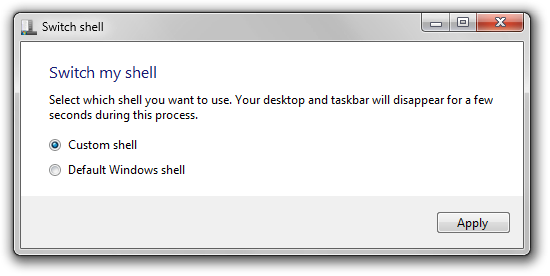

# Switch my shell [](https://github.com/azurejelly/shell-switcher/actions/workflows/dotnet.yml)
A probably not very well made utility to quickly switch Windows shells.

<p align="center">
    
</p>

## Okay but why
Because I use [explorer7](https://winclassic.net/thread/2588/explorer7-windows-explorer-10-11) to restore the Windows 7 shell on Windows 10 21H2 which does not support UWP applications (as of writing this). Most of the stuff still works, but some setings (for example, changing your account profile picture) require you to go into the newer settings app.

The usual process to switch shells would be to:
- Open up a command prompt
- Run `taskkill /f /im explorer.exe`
- Navigate to the directory where explorer7 is located at
- Run `explorer.exe`

Or, to run the default shell:
- Open up a command prompt
- Run `taskkill /f /im explorer.exe`
- Run `explorer.exe`

I imagine you can already see why this can become a bit tedious after a while.

## Project setup
Clone the repository by using:
```ps1
git clone https://github.com/azurejelly/shell-switcher
cd .\shell-switcher
```

Then open the solution on Visual Studio 2022:
```ps1
start switch-my-shell.sln
```
